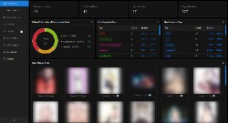
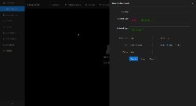
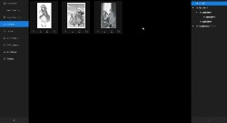
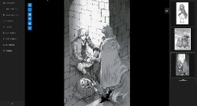

# Booru plus
Both an online and offline alternative to booru sites. Lets you view, download, organize and sort images.

## Download
- Windows installer is available in the [releases page](https://github.com/mierak/booruplus/releases) or via [direct link here](https://github.com/mierak/booruplus/releases/download/v0.2.0-BETA/Lolinizer-0.2.0-BETA.Setup.exe)
- Linux binaries might be provided in the future.

## Features
- Gallery with infinite loading, interactive file-like selection functionality(shift/ctrl+click).
- Fully fledged image view with pan-scrolling, zoom and other features. Also plays videos.
- Organize your searches with browser-like tabs.
- Search for images by tags, be it a name of the character, anime, artist or just some stuff that is in the image.
    - Exclude tags from search by simply dragging them to the excluded section in the search form.
    - Various sorting option and filters available.
- Organize favorite images in a full-featured, directory-like structure.
- Save your favorite searches and add previews for them, so you can easily find them later.
- Dashboard with statistics about images you have viewed, favorited or blacklisted.
- Post blacklisting - never see posts you blacklist ever again.
- Keeps an offline database, downloaded posts that get deleted on the server stay with you locally!

## Notes
- NSFW warning
- All the images are hosted on gelbooru.com. I own none of them.
- This application is currenlty in beta phase. However, it is pretty stable and should not have many, if any serious flaws. Though, you might still encounter some bugs, or sub-optimal UX of elements.
- Currently there is only one data source API. More might come in the future.
- Unfortunately the app is not signed with a costly certificate. Thus it might get flagged as a malware/virus, this is a false positive and the app does not contain anything malicious. You can even build the app yourself by cloning this repo and running 'npm run make'.

## Shameless plug
- This application is developed as a hobby at nights after a fulltime job. If you wish to support the development, buy me a coffee or just simply say thanks, you can do so via [this paypal link](https://paypal.me/mierakoj). All support is highly appreaciated!

## Screenshots

